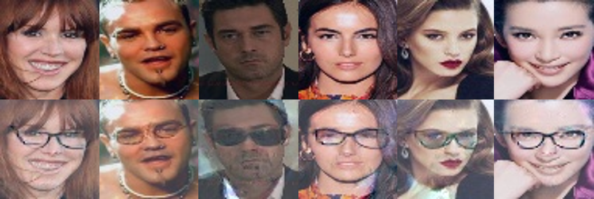

## GAN Face Attribute Manipulation with Caffe Implementation

This project uses Caffe python interface to implement [Face Attribute Manipulation](https://arxiv.org/abs/1612.05363).

Thanks to the enhanced version of py-caffe in [deepsim-caffe](https://github.com/dosovits/caffe-fr-chairs/tree/deepsim), a few lines of python code can train GANs quickly without any hack in caffe core lib. At present this project is incomplete yet, with only GAN loss + pixel loss + residual learning are implemented. 

## Demo
- Generate Eyeglasses

- Remove Eyeglasses

## Setup

You need to clone the [caffe-deepsim-branch](https://github.com/dosovits/caffe-fr-chairs/tree/deepsim) and compile py-caffe. Then replcace your caffe path in both train.py and generate.py.

## Training

- First we need to prepare the CelebA dataset since we need the annotation of face attributes. [link](http://mmlab.ie.cuhk.edu.hk/projects/CelebA.html)
- Divided the image list into two lists according to some specific attribute, e.g. Eyeglasses here. The two lists are in the following format:

    $ Positive.txt
    $ 000053.jpg 0
    $ 000093.jpg 0
    $ ...

    $ Negative.txt
    $ 000001.jpg 0
    $ 000002.jpg 0
    $ ...
  
  Note that the label 0 here is meaningless since we don't need them, we add labels here just for using the ImageDataLayer in Caffe. When the lists are ready you need to replace the source fileds in data_gen.prototxt and data_dual.prototxt with the prepared lists.

- Run the training scripts

    $ python train.py

## Testing

    $ mkdir test_result
    $ python generate.py generator.prototxt ./snapshots_test/3000/generator.caffemodel

## TODO

- Implement the perceptual loss.(I have implement a version but it seems not to work well)
- Adding dual learning.
- Change the network architecture to produce larger images(128x128), now the output is 64x64.

